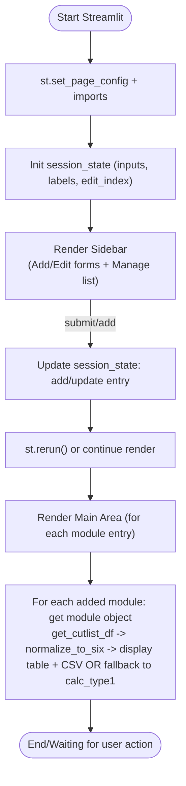
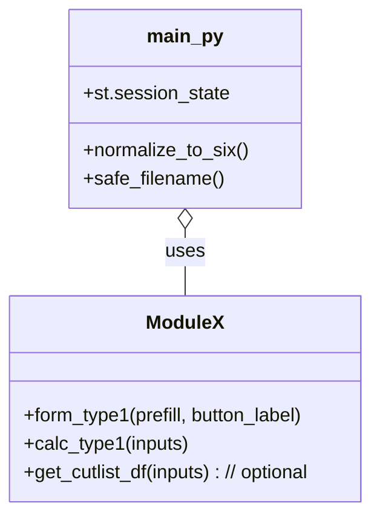
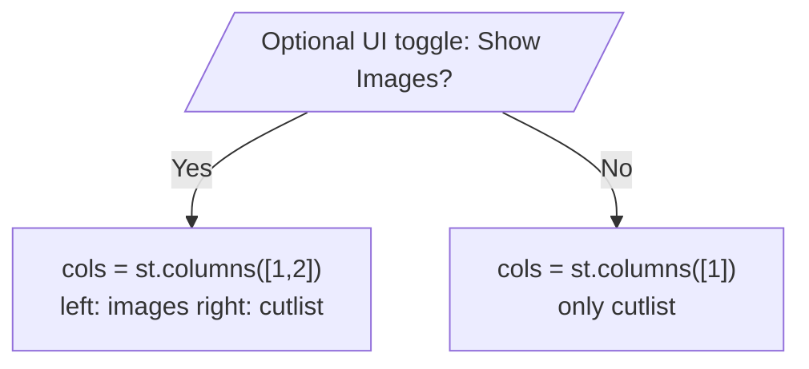

main.py — Explanation and walkthrough

Overview
--------
`main.py` is a Streamlit application that collects module-specific inputs (wardrobe/loft types), computes cutpiece lists (cutlists) for each module, and displays the results in a standardized six-column format. It also provides CSV download for each module's cutlist and preserves a simple legacy fallback output when a module doesn't supply a DataFrame.

This repository contains small modules for different wardrobe/loft types (for example `wardrobe_1door.py`, `wardrobe_2door.py`, `loft.py`, `wardrobe_2door_slide.py`, `wardrobe_3door_slide.py`) which expose form builders and calculation logic. `main.py` wires these modules into a single multi-type UI.

Files touched
-------------
- `main.py` — Streamlit app entrypoint (this file)
- `wardrobe_1door.py`, `wardrobe_2door.py`, `loft.py`, `wardrobe_2door_slide.py`, `wardrobe_3door_slide.py` — per-module form and calculation helpers (not detailed here)

Dependencies
------------
- streamlit
- pandas (imported only inside helper functions where needed)

High-level flow
---------------
1. Import modules and register a mapping of "type label" -> (form_fn, calc_fn, image_paths).
2. Initialize Streamlit page and session state to hold added module inputs and edit state.
3. Render a sidebar that lets the user add new module entries or edit existing ones using the module's `form_type1` functions.
4. For each added module in session state, compute the cutlist by calling the module's `get_cutlist_df` (if present) and normalize to a standardized six-column DataFrame. Display the user input summary and the cutlist table; allow CSV download. If no DataFrame is returned, call the module's legacy `calc_type1` and print textual lines.

Key constants and helpers
-------------------------
- `SIX_COLS` — list of standardized column names for the cutlist: ["Cut piece name", "Wood", "Colour laminate", "White laminate", "Colour edge bidding", "White edge bidding"].

- `_dims(h, w)` — helper to format numeric height and width into a compact string "H × W" (rounded to 1 decimal place). Returns empty string if conversion fails.

- `normalize_to_six(df)` — accepts a module DataFrame and returns a DataFrame containing the six standard columns. It handles two common cases:
  - If `df` already contains the six columns (case-insensitive), it reorders and returns them.
  - If `df` has the older schema (columns like `item`, `height_mm`, `width_mm`), it converts each row into the six-column format, mapping sizes into the "Wood" column using `_dims` and filling laminate and edge bidding columns with blank/0 defaults.
  - Otherwise it returns the original `df` (the caller decides the fallback rendering).

- `safe_filename(name)` — make a safe filename for CSV downloads by lowercasing and replacing non-alphanumeric characters with underscores.

Session state and sidebar behavior
----------------------------------
- Uses `st.session_state` keys:
  - `all_types_inputs`: list of dicts of user inputs for each added module.
  - `all_types_labels`: list of type labels corresponding to `all_types_inputs` entries.
  - `edit_index`: index into the lists when editing an existing entry (or None).

Sidebar controls
----------------
- When `edit_index` is set, the sidebar pre-fills the chosen module's fields and shows an "Update" button. Otherwise a new module type can be chosen from a `selectbox`.
- Each module contributes a form builder function (registered in `type_fns`) that returns a tuple `(submitted, input_data)` when the form is submitted.
- The sidebar also lists added modules and provides buttons for Edit, Duplicate and Delete for each entry.

Main area rendering (per-added-module)
--------------------------------------
For each added module (the label comes from `all_types_labels`):
- Shows a subheader with module type and option index.
- Calls the related module object (e.g., `wardrobe_1door`) to retrieve a cutlist DataFrame via `get_cutlist_df` if available. If that call raises, an error message is shown.
- If a DataFrame is returned, it's normalized to the six-column shape using `normalize_to_six`.
- The app displays the user's input key-value pairs (as four-column groups) so the user can see what was entered.
- If the normalized DataFrame is present and has the six columns, it is shown via `st.dataframe` and a CSV download button is provided.
- If not, the app falls back to calling `calc_type1` and writes each returned line (legacy textual materials list) to the page.

CSV download
------------
- When a valid six-column DataFrame is available, the UI creates a CSV with `df.to_csv(index=False).encode('utf-8')` and uses `st.download_button` to provide it to the user. The filename uses `safe_filename(tname) + '_cutlist.csv'`.

Image behavior
--------------
- `type_fns` contains `image_paths` entries (one or two image paths) which used to be displayed in the UI using `st.image`.
- Per your request, the current `main.py` has had the `st.image` display removed. If you want to re-enable images, locate the section where the app iterates `image_paths` and call `st.image(path, caption=tname, use_container_width=True)` (or restore the previous two-column layout).

How to run
----------
From the repo root (where `main.py` is located) run:

```powershell
python -m venv .venv; .\.venv\Scripts\Activate.ps1; pip install streamlit pandas
streamlit run main.py
```

Notes:
- On Windows PowerShell, use `Activate.ps1` to activate the virtual environment. If you prefer `cmd.exe`, use the appropriate activate script.
- If a module file raises an exception while generating the cutlist DataFrame, the app will show an error message for that module but continue rendering other modules.

Troubleshooting
---------------
- Missing imports: if `pandas` is missing you'll get an ImportError when `normalize_to_six` runs — install it with `pip install pandas`.
- If `streamlit` is not installed, install it with `pip install streamlit` and run via `streamlit run main.py`.
- If you get encoding issues while downloading CSV, ensure your Python environment is set to UTF-8 (Python 3.7+ should be fine) or adjust the `.to_csv(..., encoding='utf-8-sig')` if Microsoft Excel on Windows expects a BOM.

Re-enabling images (short guide)
--------------------------------
1. Find the block in `main.py` that currently contains the comment `# Only show cutpiece output (images removed as requested)`.
2. Replace it with the previous two-column layout (example):

```python
cols = st.columns([1, 2])
with cols[0]:
    if isinstance(image_paths, str):
        image_paths = [image_paths]
    for p in image_paths:
        st.image(p, caption=tname, use_container_width=True)
# the cutlist rendering continues in the second column
with cols[1]:
    ...
```

Small developer notes
---------------------
- The app trusts module functions to return dict-like form inputs and either DataFrames or textual lists. If you add new module types, follow existing modules' conventions: provide `form_type1(prefill, button_label)` (returns `submitted, input_data`), `calc_type1(inputs)` (legacy list), and optionally `get_cutlist_df(inputs)` to return a pandas DataFrame.
- `normalize_to_six` is conservative: it only maps the older schema when `item`, `height_mm`, and `width_mm` columns are present.

Contact
-------
If you'd like, I can:
- Add inline docstrings to `main.py`.
- Generate a sample module file showing the recommended API (`form_type1`, `calc_type1`, `get_cutlist_df`).
- Re-enable images and optionally add a toggle in the UI to show/hide images per user preference.

---

Done: created this walkthrough to explain `main.py` from start to end. If you want a shorter summary or a version with code snippets highlighted, tell me which sections to prioritize.

Diagrams and flows
-------------------
Below are diagrams (Mermaid) and ASCII fallbacks to help visualize how `main.py` works: UI flow, data flow, and component interactions. If your Markdown viewer doesn't render Mermaid diagrams, use the ASCII-art sections that follow each diagram.

1) UI Flow (Mermaid)



ASCII fallback (UI Flow)

Start -> Init (imports & page config) -> Init session_state -> Render Sidebar
Sidebar -> (on submit) update session_state -> Rerender -> For each module: compute/display cutlist or fallback

2) Data Flow (Mermaid)

```mermaid
flowchart LR
  UserInput[User Inputs (form)] --> InputsDict[inputs dict stored in session_state]
  InputsDict --> ModuleGetDF[call module.get_cutlist_df(inputs) if exists]
  ModuleGetDF -->|returns DF| Normalize[normalize_to_six(df)]
  Normalize -->|six-column DF| DisplayTable[st.dataframe + st.download_button]
  ModuleGetDF -->|raises or returns None| LegacyCalc[call module.calc_type1(inputs)]
  LegacyCalc --> DisplayText[st.write lines]
```

ASCII fallback (Data Flow)

User Input -> stored in session_state -> attempt get_cutlist_df -> if DF -> normalize -> show table + CSV
otherwise -> run calc_type1 -> show textual lines

3) Component Diagram (Mermaid)



ASCII fallback (Components)

main.py (Streamlit app)
  - calls into per-module files: wardrobe_1door.py, wardrobe_2door.py, loft.py, ...
  - uses their `form_type1`, `calc_type1`, optional `get_cutlist_df`

4) Re-enable images flow (Mermaid)



ASCII fallback (Image toggle)

If user enables images -> render two columns: left images (st.image) and right cutlist
If disabled -> render single column containing cutlist only

Notes on diagrams
-----------------
- Mermaid diagrams render in many Markdown viewers (VS Code with Mermaid plugin, GitHub now supports mermaid in markdown). If your viewer doesn't render them, the ASCII fallbacks provide the same information in plain text.
- If you'd like PNG/SVG exports of the diagrams, I can generate those and add them to the repo (requires a mermaid CLI or online renderer). Ask and I'll add them.